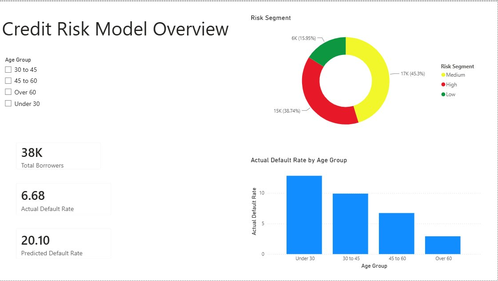
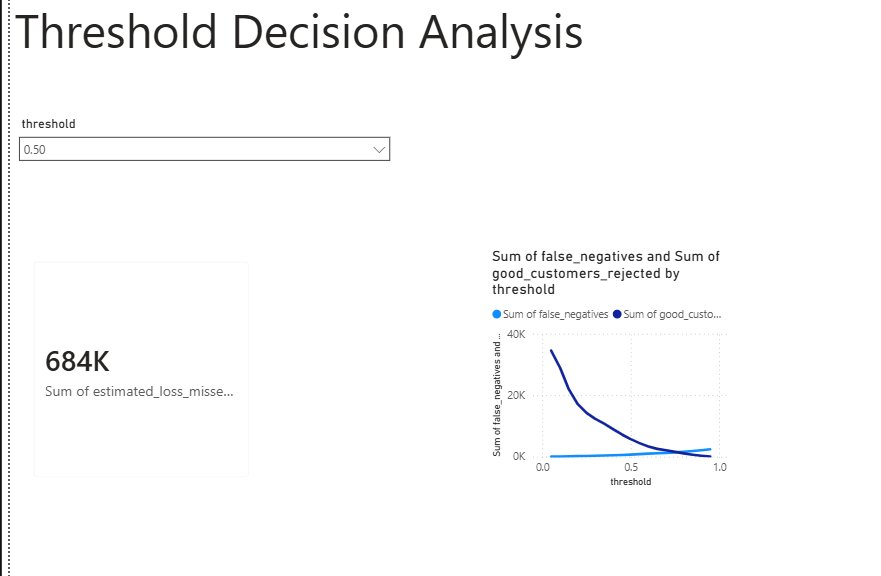

# Credit Risk Prediction Project

An end to end credit risk scoring pipeline built on a public lending dataset of 150,000 borrowers, combining SQL, Python, and Power BI.

## Overview

This project predicts whether a borrower is likely to experience a serious delinquency (90+ days late) within two years, using the "Give Me Some Credit" dataset. Beyond building a predictive model, the project includes a business decision layer that translates model output into a practical lending trade off, rather than stopping at a single accuracy metric.

## Approach

**Data preparation (SQL):** The raw dataset was loaded into a SQLite database. SQL queries were used to identify missing values, detect anomalies such as placeholder codes in the late payment columns, and build a cleaned table for analysis.

**Modeling (Python, scikit learn):** Missing values were imputed, three engineered features were added (total past due count, severe delinquency flag, income per dependent), and two models were trained and compared. A Logistic Regression baseline achieved an AUC of approximately 0.82, and a Random Forest model improved this to an AUC of approximately 0.86.

**Business decision layer:** A threshold sensitivity analysis was built in Python, calculating the trade off between missed defaults and rejected good customers across a full range of decision thresholds, along with an estimated financial cost of missed defaults.

**Dashboard (Power BI, DAX):** A two page interactive dashboard was built to present the results.

## Dashboard

### Model Overview
Summarizes the dataset and validates the model: total borrowers, actual versus predicted default rate, default rate by age group, and a risk segmentation view confirming that the model's "High" risk segment does correspond to genuinely higher real world default rates.

### Threshold Decision Analysis
An interactive page where a single decision threshold can be selected, showing the resulting estimated financial loss from missed defaults at that cutoff, alongside the full trade off curve between missed defaults and rejected good customers.

## Tools and Skills

SQL, Python (pandas, scikit learn), Power BI, DAX, predictive modeling, feature engineering, data cleaning, dashboard design.

## Dataset

The dataset used is the public "Give Me Some Credit" dataset, originally released as part of a 2011 Kaggle competition.

## Notebook

The full analysis, from data loading through model training and export, is available in `credit_risk_project.ipynb`.
